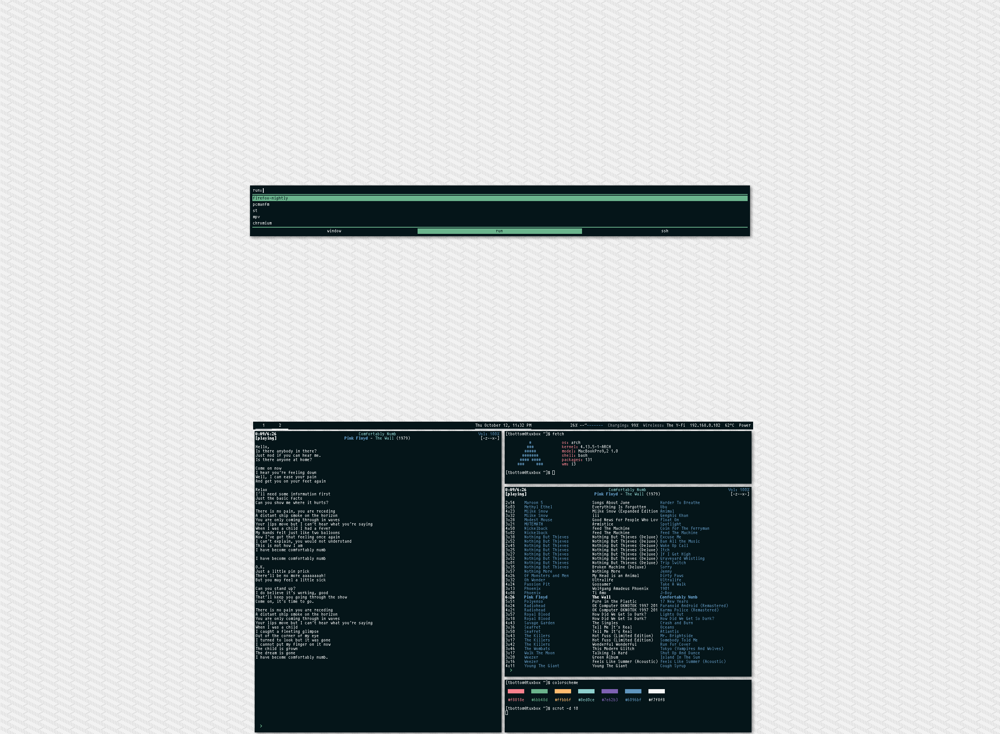
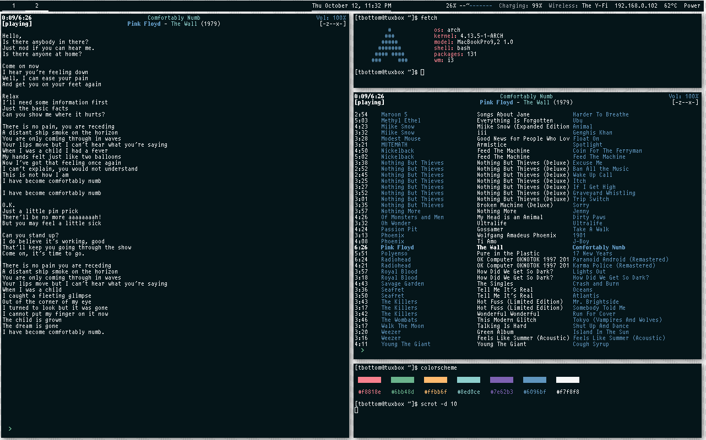
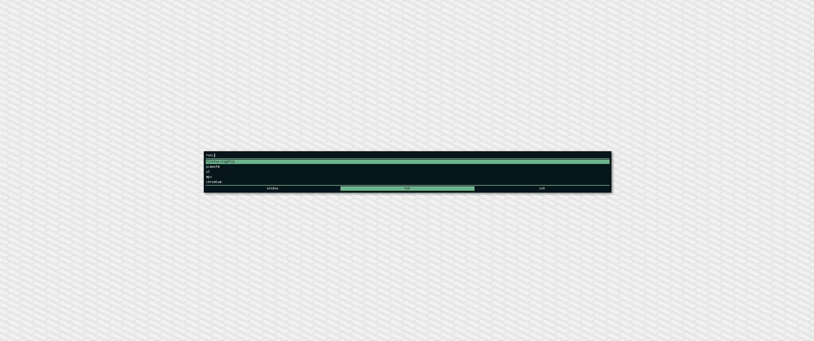

### dotfiles

ドットドットドットドット

##### screenshot

###### multiple screen layout

###### main screen layout

###### secondary screen

##### management

The dotfiles are managed using [GNU/stow][1].

Colors managed using [pywal][2].

The color scheme for wal can be found under [scripts](/extra/scripts).

##### references

The scripts were made by @MannaHoc

Polybar is based on some config I found on /r/unixporn, but I can't find it.

Wallpaper can be found on [SubtlePatterns][3]. ([Link for the lazy][4])

[1]: https://www.gnu.org/software/stow/
[2]: https://github.com/dylanaraps/pywal
[3]: https://www.toptal.com/designers/subtlepatterns/
[4]: https://www.toptal.com/designers/subtlepatterns/small-steps/
